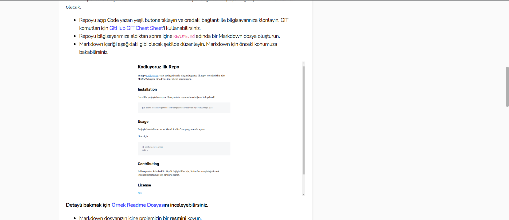

# kodluyoruz ilk repo
**bu repo[kodluyoruz](https://www.kodluyoruz.org/) FRONT-END Eğitiminde oluşturduğumuz ilk repo içerisinde bir adet READMEdosyası bir aderinde.html barındırıyor**
# Installation
**öncelikle projeyi klonlayın**

[https://github.com/yldrm127/kodluyoruzilkrepo.git](https://github.com/yldrm127/kodluyoruzilkrepo.git)

# Usage

**Projeyi cloneladıktan sonra Visual studio code 'da açınız**

**Linux için:**

*cd kodluyoruzilkrepo*

*code .*

# Contributing

**pull requestler kabul edilir  Büyük değişiklikler için Lütfen önce neyi değiştirmek istediğinizi tartışmak için konnu açınız**

